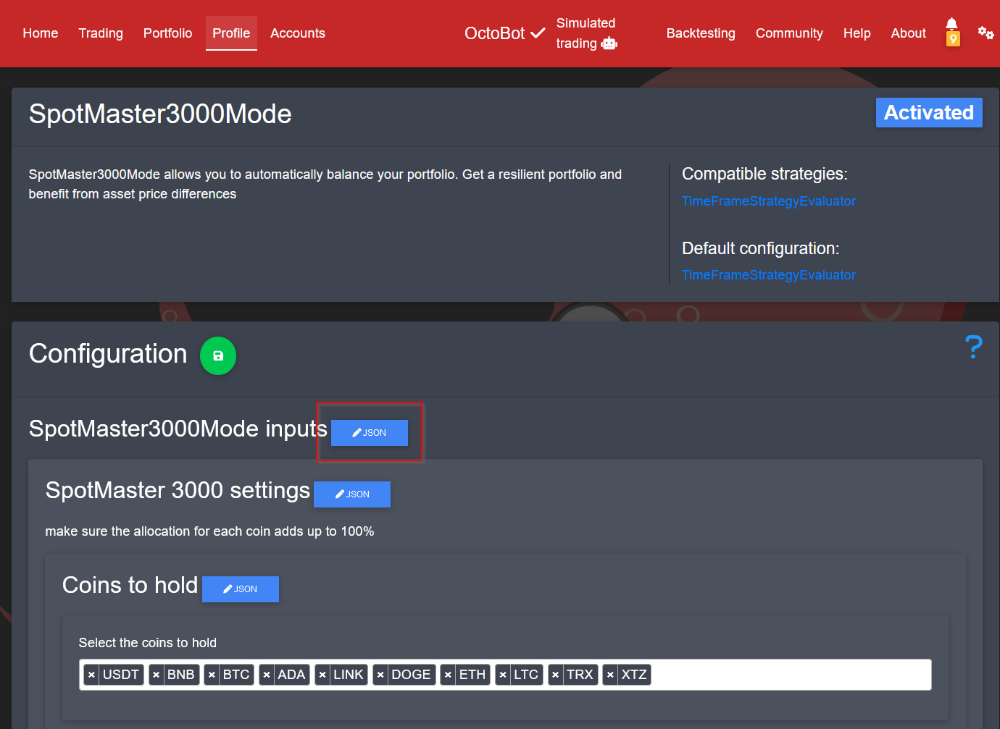

# octobot spot master 3000

* This is a spot trading mode for OctoBot
* Automatically balances your portfolio based on your settings
* Benefit from arbitrage opportunities between coins and currencies while keeping a well-balanced portfolio.
* Default settings outperform the market average (based on past data)

## how to use it

1. Follow the installation instructions below
2. Research the coins/currencies you want to hold, the gains will highly depend on your choice.
3. Enable your coins in the profile -> currencies settings
4. Go to: my-octobot-url.com/config\_tentacle?name=SpotMaster3000Mode
5. Define the allocation for each currency (make sure it adds up to 100%)
6. Make sure the reference market (for example USDT) allocation is big enough (5%-30%)
7. Customize settings - there are some more settings that will drastically change the outcome. I haven't tested much jet, so be creative and back test your settings.

## Share your settings

If you find good settings, it would be awesome if you could share it with us!

### How to share your settings

1. Go to: my-octobot-url.com/config\_tentacle?name=SpotMaster3000Mode
2.  Copy the profile config JSON

    <figure><figcaption></figcaption></figure>
3. [create a new issue here](https://github.com/techfreaque/octobot-spot-master-3000/issues/new):

* give it a title
* paste screenshots from your back testing result
* paste your profile config JSON&#x20;

## Back testing results

Back testing result for the default settings are in the screenshot's folder in this repository.

## Installation

### install trading mode

1. To be able to install packages, set a password and enable require password in my-octobot-url.com/accounts -> Interfaces -> Web
2. on your OctoBot go to my-octobot-url.com/advanced/tentacle\_packages
3. paste the trading mode package URL (latest version at the bottom)
4. press on register and install (might take a while)

### import profile
* This trading mode will only work with this profile or a copy of it
1. go to my-octobot-url.com/profile
2. click on any profile
3. click the "import a profile" button at the bottom right
4. paste the profile URL (latest version at the bottom)
5. click on "import" (might take a while)

### duplicate the profile to make it your own

duplicate the default spot master 3000 profile, so your profile will not get overwritten in future updates

## customize settings

To edit the settings either:

* go to: my-octobot-url.com/config\_tentacle?name=SpotMaster3000Mode
* or configure the trading mode from the profile page

## update

1. go to my-octobot-url.com/advanced/tentacles
2. select the Spot-Master-3000 package
3. scroll to the bottom and press "update selected tentacles"

## Questions, issues, and feature requests

Post it here: https://github.com/techfreaque/octobot-spot-master-3000/issues

## License: GPL

If you decide to customize my code, please note that it is licensed under the GNU General Public License (GPL). This means that you have the right to use, modify, and distribute the code as long as you also distribute any modified versions under the same GPL license. If you would like to contribute your modifications back to the original codebase, please open a pull request on the repository. This allows the community to review and potentially merge your changes, while also ensuring that any improvements or modifications are shared with others. Thank you for considering using my code, and I hope it serves you well.

## Your Donation Makes a Difference

Thank you for considering donating to support this open source project! Your support allows me to continue working on new and exciting features for everyone to enjoy. As this project is developed in my free time, every donation helps to motivate me to spend more time on it and bring new ideas to life. Your contribution will go towards funding the development and maintenance of this project, and will help ensure that it remains a valuable resource for the community. Thank you for your support and for helping to make this project a reality!

### USDT wallets:

USDT - TRX (Tron TRC20): TYfDkrjMeL6KpDFbB5A667V5BwYE3vzium\
USDT - BSC (BNB Smart Chain BEP20): 0x7bc06015304f00f5dccc22f009be313eb51396aa\
USDT - SOL (Solana): 8MeDCMQHXZJdhipkyoVUxahemuLy3ueEzuA8d8LTZe8o

### BUSD wallets:

BUSD - BSC (BNB Smart Chain BEP20): 0x7bc06015304f00f5dccc22f009be313eb51396aa

### BTC wallets

BTC - BTC: 163A8EDxQPjuUYUoP9u9f91dyRPAALmER7\
BTC - BSC (BNB Smart Chain BEP20): 0x7bc06015304f00f5dccc22f009be313eb51396aa\
BTC - SegWit BTC: bc1q2qnte70sdee0mw2h33jazx0dg4qd6erexzdajl\
BTC - ETH (ERC20): 0x7bc06015304f00f5dccc22f009be313eb51396aa

### BNB Wallets

BNB - BSC (BNB Smart Chain BEP20): 0x7bc06015304f00f5dccc22f009be313eb51396aa\
BNB - ETH (ERC20): 0x7bc06015304f00f5dccc22f009be313eb51396aa

### ETH wallets

ETH - ETH (ERC20): 0x7bc06015304f00f5dccc22f009be313eb51396aa ETH - BSC (BNB Smart Chain BEP20): 0x7bc06015304f00f5dccc22f009be313eb51396aa

### DOGE wallets

DOGE - DOGE: D5WteSP23WTAhM7Jh4dXxgkCL2CRjrdFJK\
DOGE - BSC (BNB Smart Chain BEP20): 0x7bc06015304f00f5dccc22f009be313eb51396aa

## download latest trading mode (installable tentacle version)

https://raw.githubusercontent.com/techfreaque/octobot-spot-master-3000/main/releases/latest/any_platform.zip

## download latest profile (importable profile)

https://raw.githubusercontent.com/techfreaque/octobot-spot-master-3000/main/releases/profile/latest/spot_master_3000_profile.zip